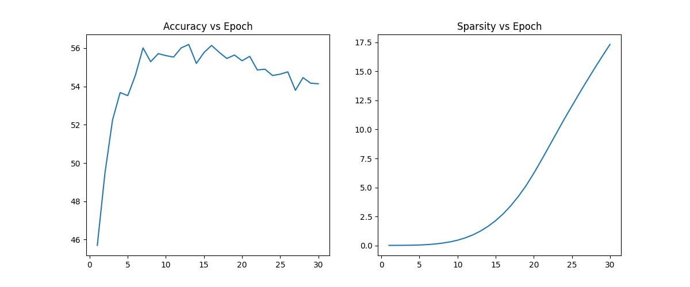
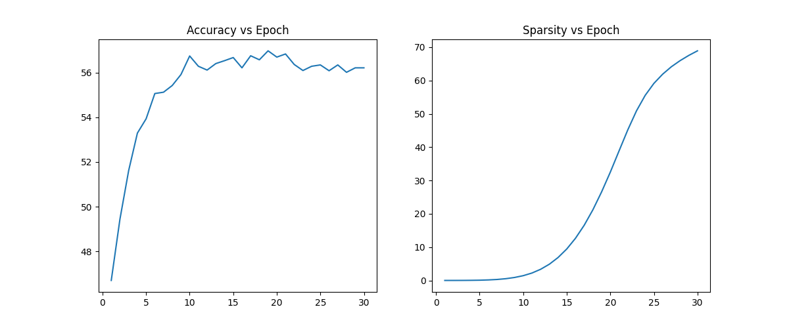
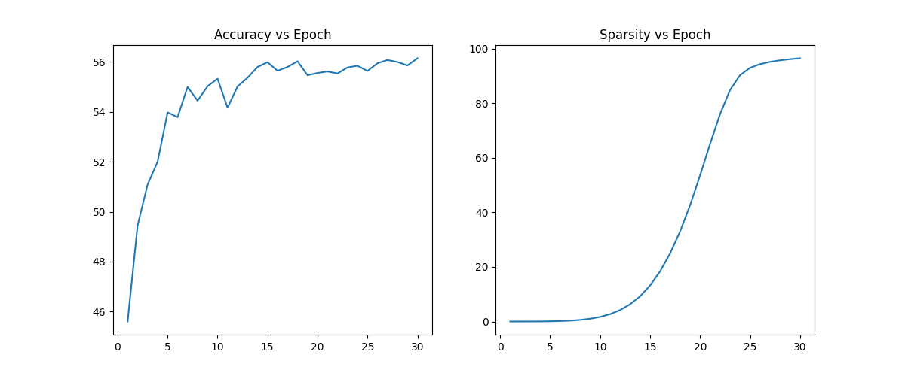
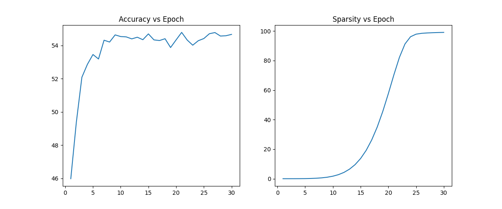
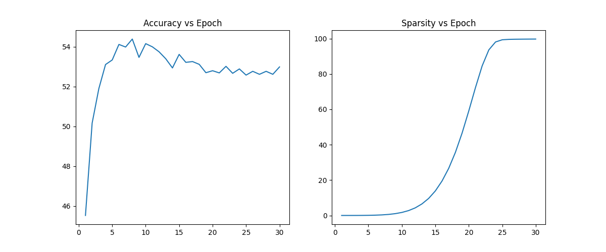

# Self-Pruning Neural Network  
**Dynamic Sparsification with Learnable Gates (PyTorch)**

---

## Overview

This repository implements a **self-pruning neural network** that learns to remove its own redundant connections *during training*, instead of relying on post-training pruning.

Each weight is paired with a learnable gate that controls its importance. Through L1 regularization, the network automatically suppresses unnecessary weights, resulting in a sparse and efficient model.

---

## Key Idea

Each weight \( w \) is modulated by a learnable gate:

\[
w' = w \cdot \sigma(g)
\]

- \( \sigma(g) \in (0,1) \) acts as a soft mask  
- Small gate values → weight effectively pruned  
- Large gate values → weight retained  

---

## Architecture

- Custom `PrunableLinear` layer (no use of `nn.Linear`)
- 3-layer MLP:
  - Input → 512 → 256 → 10
- Dataset: CIFAR-10

---

## Loss Function

\[
\mathcal{L} = \mathcal{L}_{CE} + \lambda \cdot \sum |\sigma(g)|
\]

- Cross-entropy for classification  
- L1 penalty on gates → enforces sparsity  

---

## Results

### Performance vs Sparsity

| Lambda | Test Accuracy (%) | Sparsity (%) |
|--------|------------------|-------------|
| 1e-05  | 55.37            | 10.97       |
| 1e-04  | **56.09**        | 59.33       |
| 5e-04  | 55.75            | 93.03       |
| 1e-03  | 54.47            | 97.90       |
| 2e-03  | 53.08            | 99.27       |

---

## Key Insights

### 1. Sparsity Improves Generalization
- Best accuracy at **λ = 1e-4**
- Moderate pruning acts as a **regularizer**

---

### 2. Over-Pruning Hurts Performance
- High λ → extreme sparsity (>97%)
- Leads to **loss of model capacity**

---

### 3. Model Compression
- ~59% sparsity → **~2.4× parameter reduction**
- ~99% sparsity → up to **~100× reduction (theoretical)**

---

### 4. Training Dynamics

Sparsity follows a **sigmoidal growth pattern**:
- Early → model learns features  
- Mid → rapid pruning  
- Late → saturation  

This shows the model **first learns, then compresses itself**.

---

## Visualizations

Plots are available in:
```
output/plot_lambda_*.png
```

---

### λ = 1e-5  
*Sparsity: 10.97% | Accuracy: 55.37%*



---

### λ = 1e-4 (Best Trade-off)  
*Sparsity: 59.33% | Accuracy: 56.09%*



---

### λ = 5e-4  
*Sparsity: 93.03% | Accuracy: 55.75%*



---

### λ = 1e-3  
*Sparsity: 97.90% | Accuracy: 54.47%*



---

### λ = 2e-3  
*Sparsity: 99.27% | Accuracy: 53.08%*



---

### Interpretation

- **Accuracy Curve**  
  Rapid improvement in early epochs, followed by stabilization.  
  Moderate pruning maintains or slightly improves accuracy.

- **Sparsity Curve**  
  Exhibits a **sigmoidal growth pattern**:
  - Early phase → minimal pruning  
  - Mid phase → rapid pruning  
  - Late phase → saturation  

This confirms that the model **first learns meaningful representations, then compresses itself** by removing redundant connections.

---

## Repository Structure
```
.
├── self_pruning_nn.ipynb
├── output/
│       ├── logs_lambda_*.json
│       ├── model_lambda_*.pth
│       ├── plot_lambda_*.png
└── README.md
```